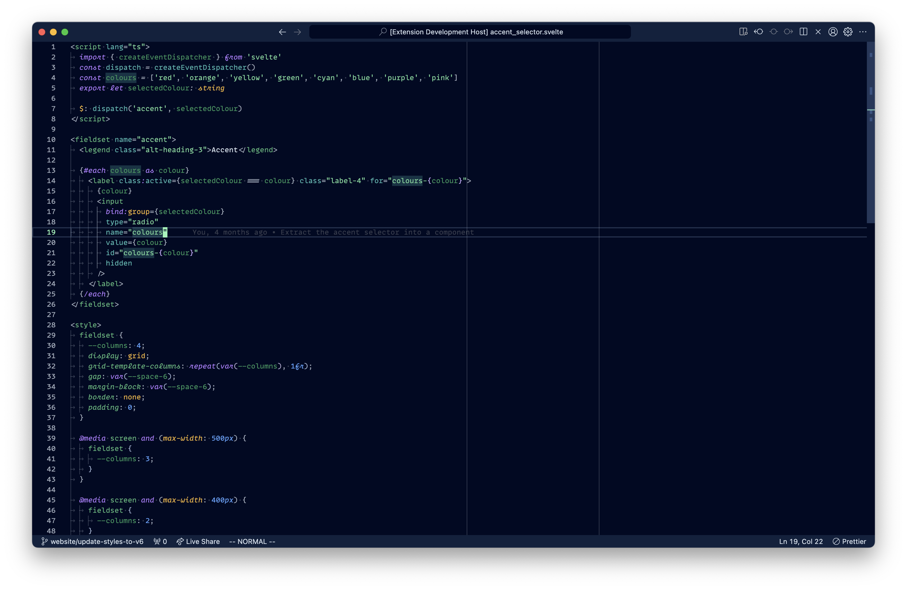
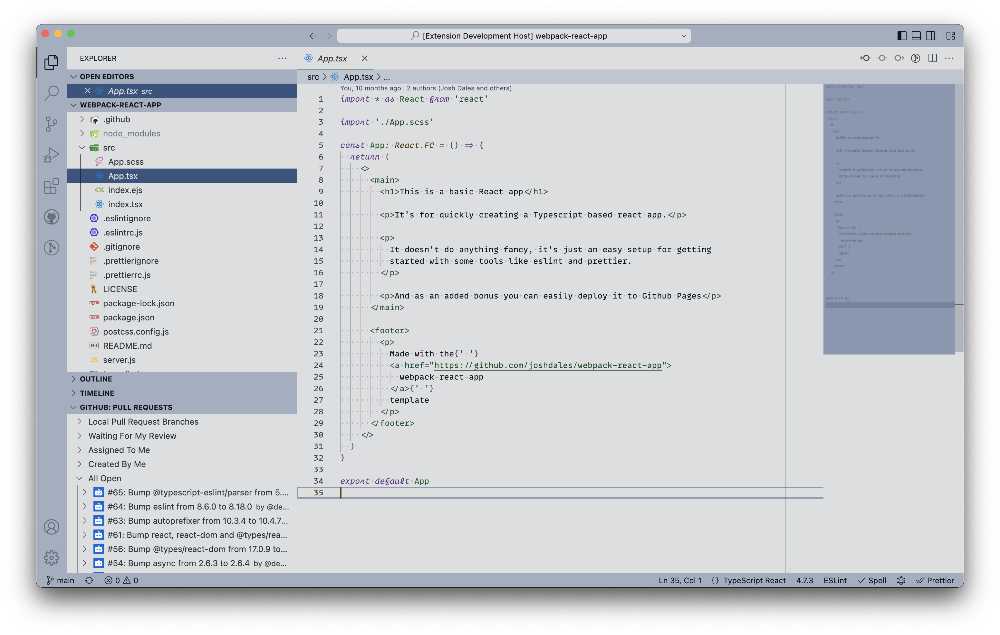

# Taiga VSCode Theme

A theme for VSCode. Built with a font that has cursive italics in mind.



## Example Settings
Coding-specific fonts that have a cursive variant and/or ligatures like [MonoLisa](https://www.monolisa.dev/)
or [Dank Mono](https://philpl.gumroad.com/l/dank-mono).
```json
"editor.fontFamily": "MonoLisa, Dank Mono, JetBrains Mono, Victor Mono",
```
